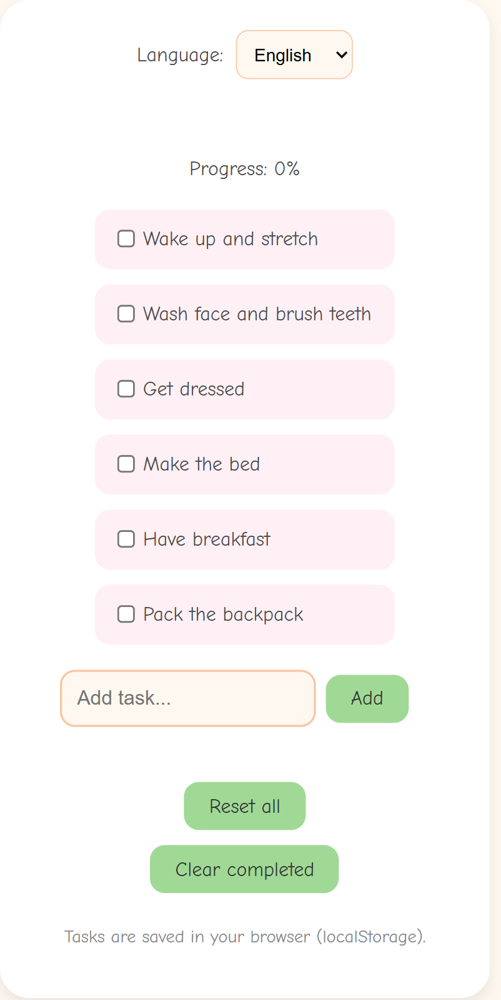
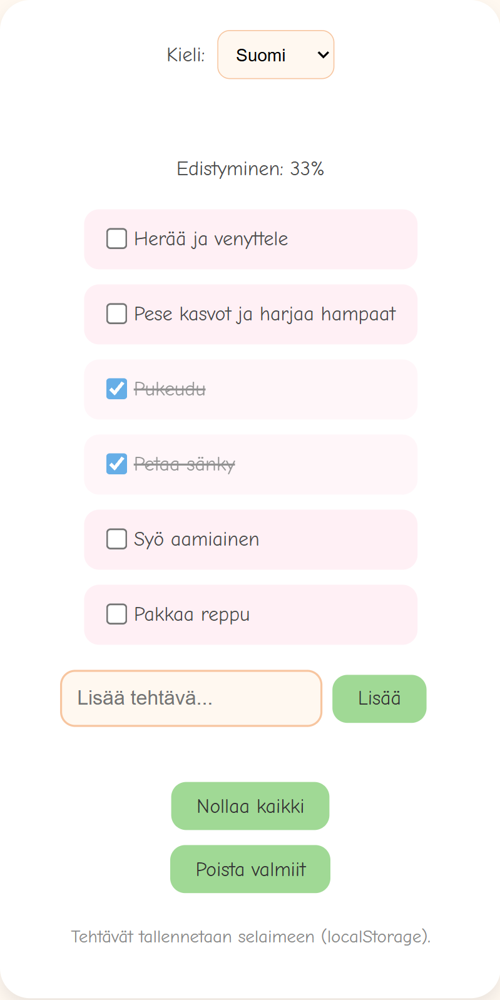
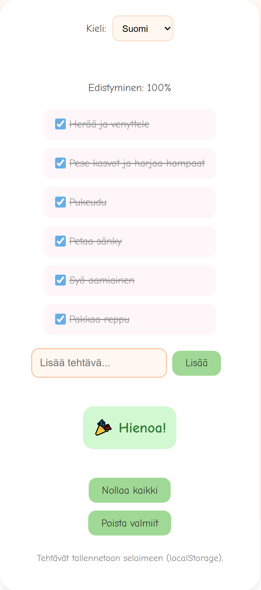

# Aamu Sankari

**Aamu Sankari** is a project focused on making mornings easier and more motivating — a simple, friendly experience that helps users start the day with structure and energy.

## Overview

**Aamu Sankari** is a kid-friendly web application that helps children follow their morning routine step by step in a calm and motivating way.

The app guides kids through essential morning tasks such as:
- Getting dressed
- Brushing teeth
- Washing up
- Eating breakfast

It is designed to make mornings smoother for both children and parents.

### Tech Stack
- JavaScript
- CSS
- HTML 

### Getting Started

Install dependencies:

npm install

Run locally:

npm run dev

Build for production:

npm run build

